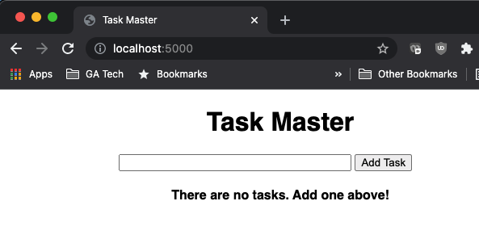
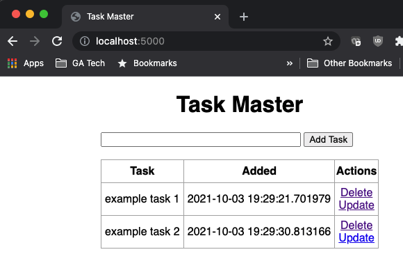
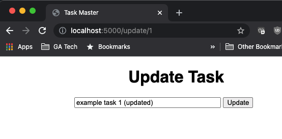
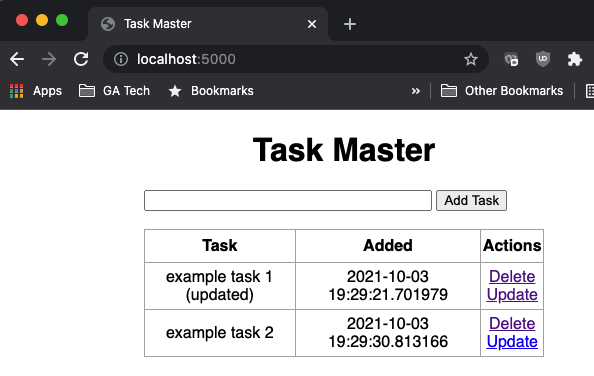

# example-python-flask

Following freeCodeCamp.org's tutorial "Learn Flask for Python": https://www.youtube.com/watch?v=Z1RJmh_OqeA, and providing some notes 

This is a very simple CRUD web app that makes use of Python Flask library (with Jinja2 templating & sqlite database)

Steps below written as executed on macOS

### Step 1. Set up Virtual Environment
```
cd path/to/project
pip install virtualenv
virtualenv env
source env/bin/activate
```

### Step 2. Install Python libraries 
```
pip install -r requirements.txt
```

### Step 3. Build code for Flask app
Code is in `app.py`, `base.html`, and `index.html` (styling via `static/css/main.css`)
   
### Step 4: Initialize database
In terminal, start an interactive python3 shell (while still in virtualenv "env"):
```
python3
>>> from app import db
>>> db.create_all()
>>> quit()
```
This creates the sqlite database file test.db in the project root directory

### Step 5: Use app
In terminal, start the app:
```
python3 app.py
```

Open browser and go to http://localhost:5000

1. Initial screen: add some tasks
   


2. After adding tasks
   


3. Clicking "Update" link on a task takes you to "Update Task" page
   


4. After clicking "Update" button, redirects back to "Task Master" page with task updated
   

### Appendix: Notes on features & conventions
* HTML template inheritance: The curly brace / percent signs (e.g. ``) are [Jinja syntax](https://jinja.palletsprojects.com/en/3.0.x/templates/#base-template). In this example, the blocks define two blocks that child templates can fill in. All the block tag does is tell the template engine that a child template may override those placeholders in the template.
* CSS template `static/css/main.css` is linked in the HTML template `templates/base.html`
    - In `base.html`, we use the `Flask.url_for` method for static files explained here: https://flask.palletsprojects.com/en/2.0.x/tutorial/static/#static-files - Note: can also do this with other files, like JavaScript functions or logo images
* `app.py`
  - `Flask(__name__)`: This gets the import name of the place the app is defined.  This way, when using a package and app defined in `__init__.py`, then the `__name__` will still point to the correct place
* Program flow
  - `index.html` inherits from `base.html`
  - Create, Update, and Delete transactions to the sqlite database are handled via API endpoints defined in `app.py` (see the `@app.route`) lines
  - Current state of task table is queried from the sqlite database.  Example: `tasks = Todo.query.order_by(Todo.date_created).all()`
* Deploying to the web
  - Heroku: covered in the tutorial here: https://youtu.be/Z1RJmh_OqeA?t=2484